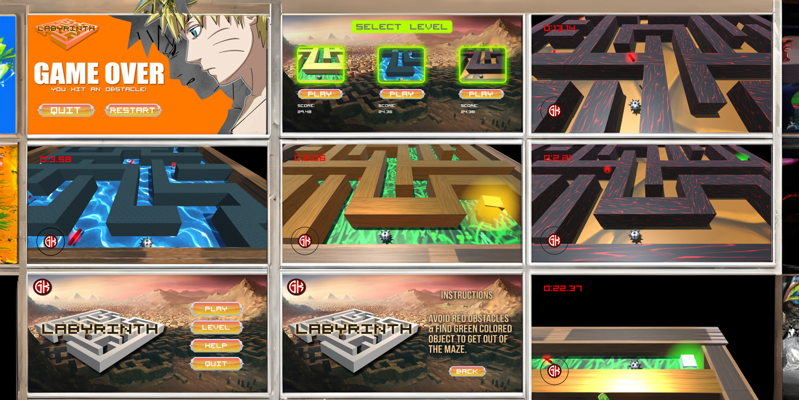

# Labyrinth - An Android Maze Game

This project is a thrilling 3D Android maze game where the goal is to find your way out of the maze in the best possible time!

The game demonstrates the following features:

- 3D Environment
- Joystick Control
- Dynamic Obstacles
- Rewards System
- High Score Tracking
- Progressive Difficulty

## Features

- **3D Environment:** Experience a fully immersive 3D maze environment.
- **Joystick Control:** Navigate through the maze using intuitive joystick controls.
- **Dynamic Obstacles:** Face various hurdles and traps that simulate real-life challenges.
- **Rewards System:** Collect rewards like extra lives and stealth mode to aid your progress.
- **High Score:** Achieve the best time to complete the maze and see your high score updated.
- **Progressive Difficulty:** As you advance through levels, the mazes become more complex, and the number of hurdles and traps increases.


## Authors

- [@gururaj_koni](https://www.github.com/gururajkoni04) [@linkedin](https://www.linkedin.com/in/gururajkoni/)

## Getting Started

This project uses Unity. To build this project, follow these steps:

1. **Clone the Repository:**
   ```bash
   git clone https://github.com/your-username/Labyrinth---An-Android-Maze-Game.git
   ```
2. **Open in Unity:** Open the project in Unity.
3. **Build the Project:** Build the project for Android.
4. **Run on Device:** Install the APK on your Android device.

## Screenshots



---

Enjoy playing **Labyrinth** and may you find your way out in the best time possible!

---
